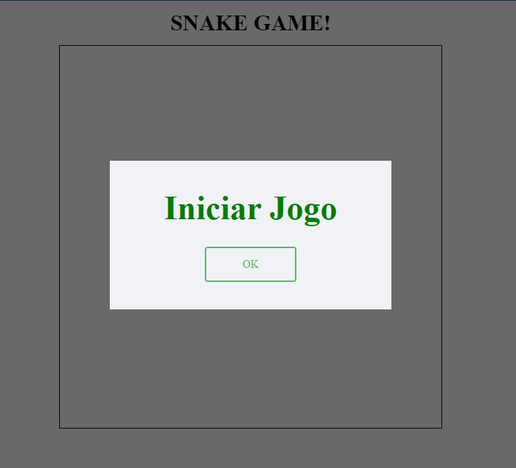
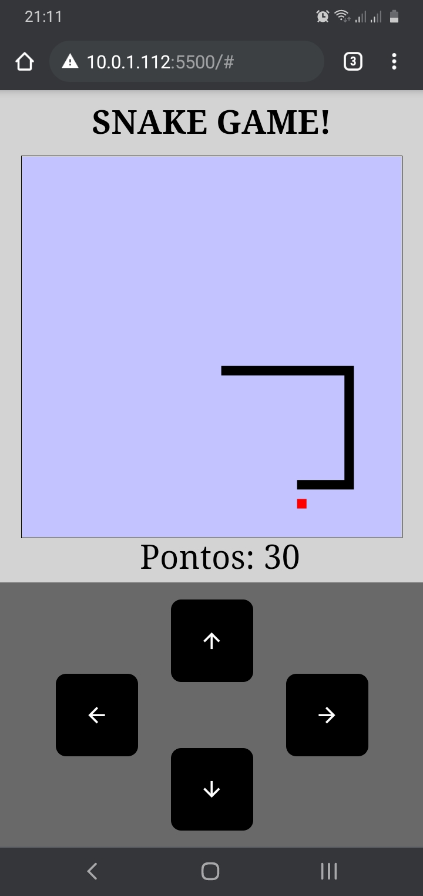

# Jogo da cobrinha

## Este projeto é parte do curso HTML Web Developer da Digital Innovation One

Então o projeto propõe a recriar o jogo da cobrinha utilizando HTML, CSS e JAVASCRIPT.

Aprendi a criar o jogo do zero com javascript puro e incrementei novas funcionalidade.

O jogo esta com responsividade podendo abrir no celular e então criei um teclado
direcional com as setas podendo jogar no celular. Foi adicionado um placar para o jogador
acompanhar os pontos a cada comida da maça.

